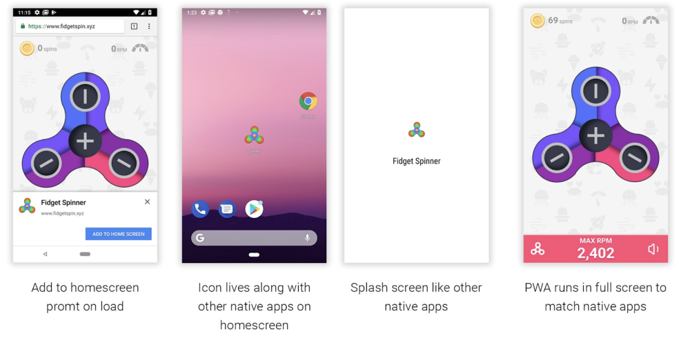

Technology is one of the defining features of humanity. It is ubiquitous in modern society and plays an important role in nearly everything that humans do. New technologies frequently spur my imagination, and PWA technology has definitely done so. PWA stands for **Progressive Web Application** and it defines a type of web application that aims to bridge the gap between applications accesed via a browser and those installed natively on user devices.

Native applications have always had the upper hand when it comes to supporting great features compared to traditional web applications. The arrival of PWAs has changed the game completely, currently these web apps with superpowers have the ability to be installed on devices just like native applications and support almost 85% of the device features such as geolocation, microphone and USB-connections. Google recently described PWAs as "web applications that took all the right vitamins", and they deserve it. Coupled with other modern technologies, PWAs will surely define the future of the web.

_The image above shows an example of a PWA installation. It is importnant to note that PWAs are installed straight from the browser. They dont need approval from either App Store or Play Store._

In that same spirit, Hyblog was crafted using the best technologies including PWA capability to maximise on efficiency and user friendliness. This blog can be installed on most mobile and computer platforms just like a mobile or desktop application.It is also blazing fast even when users are on slow network connections thanks to efficient loading of all site assets. It can also provide full offline access for all articles when a user installs it on their smartphone or computer.
Blogposts are also organised into categories and tagged with relevant phrases. Readers can view all articles under a particular category or those articles that have been tagged with a certain phrase.

A notification system is also in development that will enable readers to subscribe to all posts from Hyblog or even posts from particular categories only. These notifications will arrive on the users device instantly with the title and link of the latest article that has been released. All these bits of awesome technologies will work to ensure readers have access to the best and the latest content instantly and at all times, even when offline.

To get the best of this blog, we recommend our readers to install the blog on their devices for easy access at all times. The application is also very small in size and wont take much of your data or storage space on your devices.
When new posts are released the blog auto updates itself if there is an internet connection. Alternatively, a user can also manually reload it like any installed application to get the latest content.

There is also a comment section under each post where you can share your thoughts and opinions on that article. It requires to login before you can comment but you dont need to create an account as you can easily login using either your Google, Facebook or Twitter account with just a click of a button.

Below are the few installation steps of this blog site for each platform

## Android Chrome

Upon loading this site, you'll see an install banner pop up asking whether you want to add this app to your Home screen.If you choose not to add it to your Home screen at this point, you can do so later by clicking the 3 dots on the top right side of chrome and select 'install app' from the dropdown.

## Android Firefox

Upon loading this site, you'll see a "home" icon with a plus (+) icon inside it on the right end of the address bar— this is the "Add to Home screen" icon. Tapping this will show a confirmation banner — pressing the big + ADD TO HOME SCREEN button completes the action, adding the app to the Home screen.

## IOS Safari

Upon loading this site,tap the 'Share' button, look for 'Add to Home Screen' and tap it. Confirm the app name then press 'add' to install the site as an IOS app.
N/B..IOS Chrome doesnt support PWA technology, for this reason IOS users wont be able to access the blog while offline, all other blog features are available though.

## Desktop computers and laptops

Upon loading this site, you'll see an install icon inside the address bar on the right side. Follow the onscreen instructions to install the PWA.

#### More info on PWAs and how to install them on other platforms is readily available on the internet
